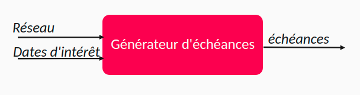
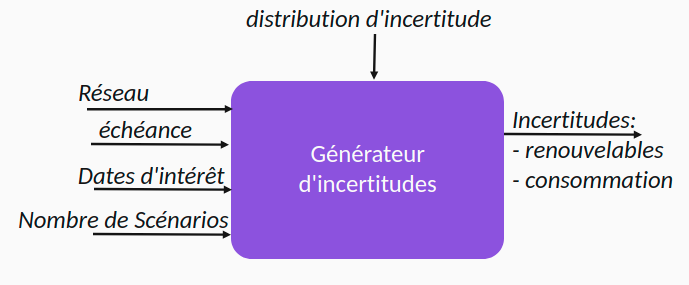
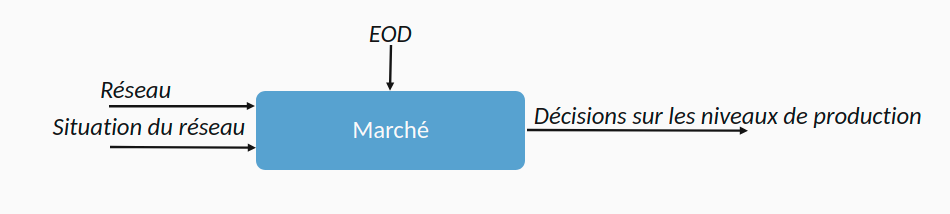
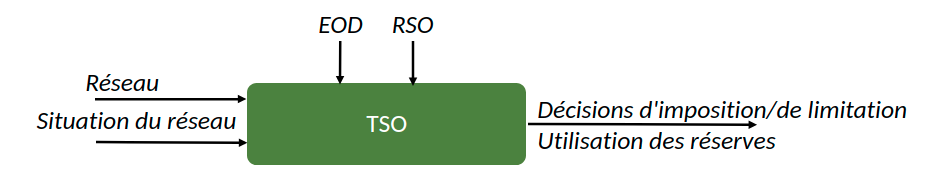
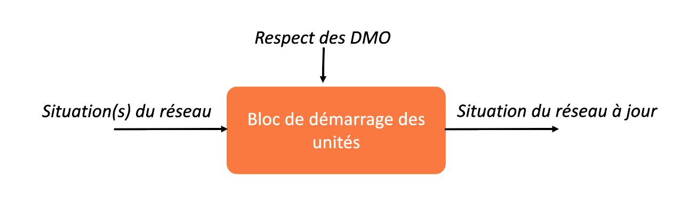
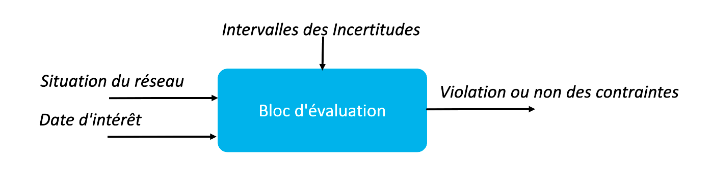
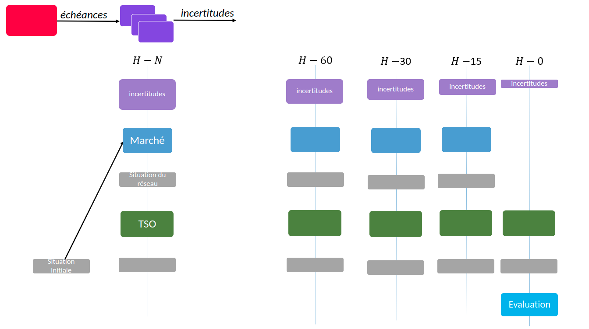

# Architecture

## Introduction

Cette section tente de découper la problématique traitée en définissant plusieurs composantes.
Chaque composante a une responsabilité.
Une responsabilité peut être définie par le sous-problème intermédiaire que la composante doit résoudre,
 des entrées et des sorties de ce sous-problème.
Chaque composante doit résoudre le sous-problème qui lui est assigné indépendamment des autres composantes
 pourvu que les bonnes entrées lui soient fournies.

L'idée est de pouvoir modifier le fonctionnement interne de chacune de ces composantes.
Ceci permettra de modifier le fonctionnement interne d'une composante pour s'adapter à un processus de gestion simulé sans avoir à
 modifier les autres composantes.
 Ce qui permettra aussi une réutilisation des composantes.

## Différents Blocs

Notons que les composantes présentées ci-dessous peuvent elle-même être découpées en de plus petites composantes.
Par exemple, une composante de génération d'incertitudes sur l'ensemble du réseau pourrait être constituée de plusieurs
 composantes générant chacune les incertitudes d'une unité de production ou d'un point de consommation.

### Bloc de Génération des échéances

Le lancement des calculs se faisant à plusieurs échéances, une composante pourrait être dédiée à la détermination de ces échéances de lancement.
Le générateur d'échéances peut suivre sa propre logique de génération des échéances :
 Par exemple, une discrétisation de l'espace pour avoir des échéances toutes les 5 minutes.
 Ou encore, une détermination des échéances en fonction des attributs des unités de production présentes sur le réseau.
Les blocs que nous définiront par la suite devront fonctionner indépendamment du choix du fonctionnement de la composante
 de génération des échéances.
 C'est-à-dire qu'ils n'imposeront pas de contraintes sur les échéances devant être simulées
  mais qu'ils se baseront sur les échéances effectivement générées.

### Bloc de Génération des incertitudes

Dans le cadre de ce travail,
 nous supposons que les incertitudes sur les niveaux de consommation et sur les capacités de production des unités renouvelables
 se précisent au fur et à mesure que nous nous rapprochons du temps réel.
Nous avons donc besoin d'une réalisation de ces incertitudes à chaque échéance de lancement.
Cette composante assure la génération de plusieurs scénarios d'incertitudes vue d'une échéance donnée pour une ou plusieurs dates d'intérêts.

La responsabilité du générateur d'incertitudes se résume à la génération d'un nombre demandé de scénarios,
 pour les dates d'intérêt demandées.
Les scénarios générés itérativement à des échéances différentes seront donc indépendants.
De plus, c'est un autre composant qui doit s'assurer de la cohérence du nombre de scénarios tout au long du lancement.

### Bloc marché

Ce bloc représente les différents marchés à simuler.
Ces fonctionnements internes dépendront du processus de gestion envisagé
 mais sa responsabilité principale est de fixer un planning de production qui assurerait les contraintes d'offre et de demande (EOD).
Pour cela il dispose d'une vision de l'état du réseau.
C'est le marché lui-même qui décidera quelles données du réseau il a besoin de regarder
 (s'il a besoin de regarder les décisions TSO, les niveaux de réserve,...) pour bien assurer sa responsabilité.

### Bloc TSO

Ce bloc simulerait le responsable du réseau :
 Il considérerait une situation du réseau en entrée décrivant les incertitudes sur le réseau ainsi que les choix des marchés.
 Le TSO répondra à cette situation d'entrée, en émettant des décisions d'imposition et de limitation.
 La principale résponsabilité du TSO est d'assurer les contraintes réseau pour cela il dispose d'une réserve, en plus des unités de production.

### Bloc de Démarrage des unités

Ce bloc est responsable du respect des DMO et des DPs dans le planning reflété par la situation du réseau.
Il considère une ou plusieurs situations du réseau en entrée,
 les agrège pour n'en fournir qu'une situation mise à jour qui respecte les contraintes de démarrage des unités de production.

### Bloc d'évaluation

Ce bloc est responsable de l'évaluation du processus de gestion en question et des décisions prises dans le cadre de ce dernier.
Il permet de vérifier si les choix effectués permettent de satisfaire la demande
 et de se prémunir contre les pires cas d'incertitudes sur le réseau.
Il considère en entrée une situation du réseau
 (comportant le planning des unités de production) résultant des choix faits au cours du processus.
Il regarde les intervalles d'incertitudes à la date du lancement pour une date d'intérêt
 et il en déduit si nous pourrons faire face à toutes ces incertitudes.

## Le réseau

### Description du réseau brut

Le réseau électrique peut être vu comme un graphe.
Un point/sommet de ce graphe est une localisation appelée _bus_ ou _noeud_.
Les arêtes reliant ces noeuds sont appelées des _branches_.

Une _branche_ est définie par les deux bus qu'elle relie et par une limite maximale de production d'électricité pouvant circuler sur la branche.

A un instant donné, un _bus_ peut être décrit par un niveau de production et un niveau de consommation d'électricité.
Il peut comprendre une ou plusieurs composantes du réseau d'électricité à savoir :
 des unités imposables et/ou des unités limitables voire de la réserve localisée.

Dans le cadre de ce travail, nous considérons que nous disposons d'un certain niveau de réserve.
Cette réserve est délocalisée.
Une clé de répartition guidée par les coefficients de la PTDF décidera indirectement de cette localisation.

### Description de la situation du réseau

Le réseau peut etre décrit grace à :

- état des unités à l'échéance : unités démarrées, en démarrage, éteintes
- planning prévisionnel du TSO pour tous les scénarios et toutes les dates d'intérêt :
 donnant le niveau de production des unités imposables, les limitations des unités limitables, les niveaux de réserve.
- planning prévisionnel du marché pour tous les scénarios et toutes les dates d'intérêt :
 donnant le niveau de production des unités imposables, les limitations des unités limitables, les niveaux de réserve
 (potentiellement toujours nulle du point de vue du marché ? mais pas forcément pour généraliser le processus).
- Les incertitudes du réseau vues à l'échéance :
 niveaux de consommation et capacité de production des limitables pour tous les scénarios et toutes les dates d'intérêt

A voir :
- Il serait potentiellement possible de ne pas avoir besoin des deux plannings TSO et Marché
 mais d'en avoir qu'un à mettre à jour selon l'évolution du processus
 (potentiellement avec le bloc de démarrage des unités ou un autre qui prend cette responsabilité)
- Le planning ne semble pas suffire pour traiter les DMO/DP,
 il est probablement nécessaire d'avoir l'information sur les démarrages des unités à l'échéance pour pouvoir faire le traitement.

<!--  -->

## Schéma Général

L'idée derrière cette notion de bloc de responsabilité est de pouvoir enchaîner ces blocs de plusieurs façons
 afin de représenter des processus de gestion différents.

Ci-dessous un exemple d'enchaînement des blocs :

<!--  -->
