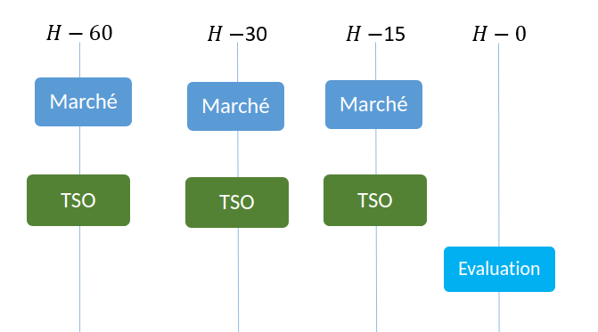
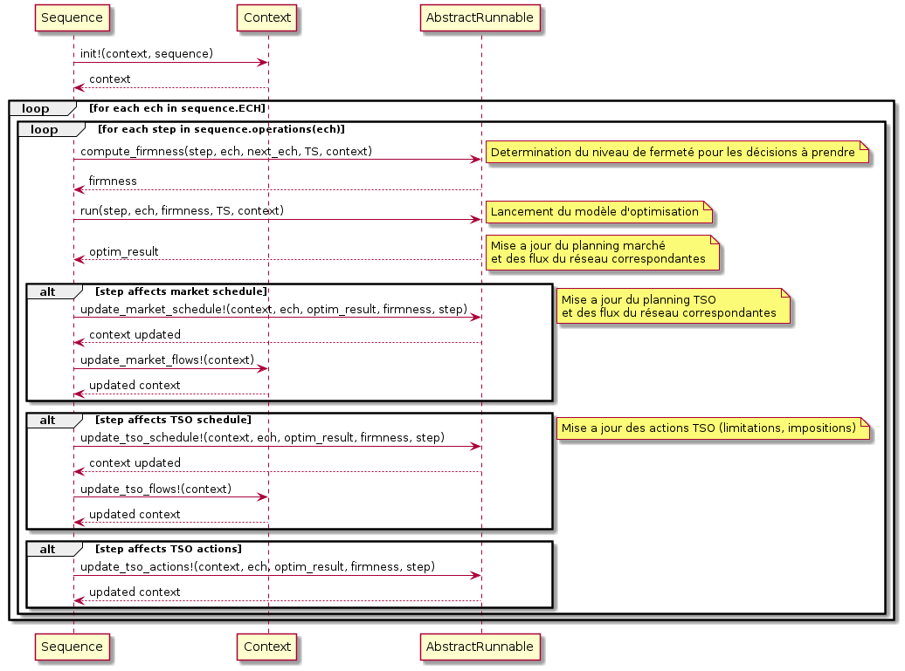

# Sequence

## Etapes d'une séquence

Une séquence définit un processus de gestion.
Le processus de gestion est défini par une suite d'étapes pour chaque échéance.
Une étape correspond, généralement, à un module décisionnelle (par exemple, le marché) ou utilitaire (par exemple, l'étape d'évaluation).

La figure ci-dessous représente un exemple de séquence :



Dans cette figure, la séquence concerne 4 échéances différentes : 60 minutes, 30, 15 et 0.
A chacune des trois premières échéances, deux modules décisionnels s'enchainent : Le marché et Le TSO.
Pour la dernière échéance, seul le module d'évaluation est lancé.

En matière d'implémentation, une étape correspond à un [`PSCOPF.AbstractRunnable`](@ref).
Il s'agit simplement d'un module décisionnel qui se lance dans un contexte donné,
 qui prend certaines décisions et qui met à jour la situation réseau.
Ainsi, rajouter un acteur ou simuler un nouveau fonctionnement d'un acteur déjà présent,
 revient à implémenter une nouvelle étape, donc un [`PSCOPF.AbstractRunnable`](@ref).

Le fonctionnement d'une étape sera mieux expliqué [plus bas](@ref sequence_execution)

## Génération d'une séquence

Certains processus de gestion (appelés modes de gestion) sont implémentés par défaut.

Un générateur de séquence permet de créer automatiquement les séquences correspondantes.

Pour tester une nouvelle séquence, il suffit de la définir comme un dictionnaire.
Par exemple, la séquence correspondant à la figure ci-dessous peut être décrite de la façon suivante
 (si nous avions déjà implémenté les modules décisionnels : Market, TSO et Evaluation)

```julia
sequence = PSCOPF.Sequence(SortedDict(
            DateTime("2015-01-01T07:00:00")     => [Market(), TSO()],
            DateTime("2015-01-01T07:30:00")     => [Market(), TSO()],
            DateTime("2015-01-01T07:45:00")     => [Market(), TSO()]
            DateTime("2015-01-01T08:00:00")     => [Evaluation()]
        ))
```

## [Exécution d'une séquence](@id sequence_execution)

Le diagramme de séquence décrivant l'exécution d'une [`sequence`](@ref PSCOPF.Sequence), est le suivant:



### Contexte d'exécution

Avant de lancer la séquence, nous initialisons un contexte d'exécution.

Le contexte d'exécution permet de ranger toutes les informations nécessaires à l'exécution de la séquence.
Donc, il permet de représenter la situation du réseau à un moment donné.
Ce concept est mené à évoluer, et mieux se préciser, au fur et à mesure que les travaux avancent.

Les éléments importants qui sont stockés dans le contexte sont :

- Le réseau électrique : Il s'agit de la description du réseau physique invariable (les bus, les branches, les unités et la PTDF)
- L'état initial de chacune des unités de production
- Les incertitudes sur les injections et consommation
- Les plannings des unités du point de vue du marché et du point de vue du TSO
- Les actions du TSO : impositions et limitations

Des informations supplémentaires peuvent être stockés également :
- Les dates d'intérêt
- Les dates des échéances
- Le mode de gestion considéré
- Les flux sur les branches du réseau du point de vue du marché et du TSO (résultent du planning des unités et des incertitudes)
- Les incertitudes liées à l'étape d'évaluation
- ...

Remarque :
Le stockage de deux plannings (un planning marché et un planning TSO)
 permet d'avoir une meilleure vue des décisions.
Considérons le cas où le TSO continue de s'éxecuter pendant la FO mais pas le marché,
 le modèle du TSO pourra considérer le dernier planning du TSO pour les décisions de démarrage déjà effectuées
 et de considérer le dernier planning marché disponible pour les coûts d'ajustement.

### exécution d'une étape

Après l'initialisation, l'exécution de la séquence revient à exécuter ses étapes l'une après l'autre à des échéances données.

#### Calcul des fermeté des décisions

L'appel à la fonction [`compute_firmness(step, ech, next_ech, TS, context)`](@ref PSCOPF.compute_firmness)
 permet de déterminer tout d'abord le niveau de [fermeté des décisions](@ref firmness_module) à prendre par le décideur `step`
 à l'échéance `ech` pour chacune des dates d'intérêt (de `TS`)
 sachant que l'échéance suivante est next_ech (mais potentiellement ce décideur considéré risque de ne pas s'exécuter à l'échéance suivante).
En sortie, nous aurons le niveau de fermeté nécessaire pour chacune des décisions de démarrage (liées à la DMO)
 et des niveaux de production (liées à la DP) pour chacune des unités concernées et à chaque date d'intérêt.

#### Lancement de l'étape

L'appel à la fonction [`run(step, ech, firmness, TS, context)`](@ref PSCOPF.run)
 exécute le coeur de l'étape et fournit un certain résultat à exploiter.
Ceci correspondera souvent au lancement d'un modéle d'optimisation associé
 et à la récupération des décisions qui en résultent.

En vue du résultat obtenu, certaines informations doivent être mises à jour.
 Pour l'instant, ceci est fait de façon verbeuse mais qui permet de voir explicitement ce qui est modifié via plusieurs appels de mise à jour.


#### Mise à jour du contexte d'exécution

##### Plannings du marché et du TSO

Suite à l'exécution d'une étape, le résultat du modèle d'optimisation peut indiquer les unités à démarrer/arrêter
 et les niveaux de production des unités. Ces décisions doivent être retranscrites dans le planning du marché, du TSO ou des deux.

La fonction [`affects_market_schedule(step)`](@ref PSCOPF.affects_market_schedule),
 respectivement [`affects_tso_schedule(step)`](@ref PSCOPF.affects_tso_schedule),
 permet d'indiquer si l'étape `step` affecte le planning du marché, respectivement du TSO.

La fonction [`update_market_schedule!`](@ref PSCOPF.update_market_schedule!),
 respectivement [`update_tso_schedule!`](@ref PSCOPF.update_tso_schedule!),
 permet de faire la mise à jour.


##### Actions du TSO

De façon similaire à la mise à jour des plannings, les décisions d'impositions/limitations
 peuvent être retranscrites dans les actions TSO.
Une étape indique qu'elle met à jour ces actions via la fonction [`affects_tso_actions(step)`](@ref PSCOPF.affects_tso_actions)
 et effectue la mise à jour via [`update_tso_actions!`](@ref PSCOPF.update_tso_actions!)
